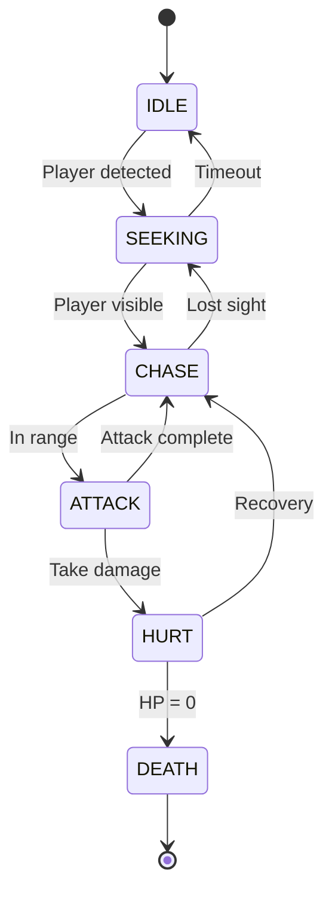

# Enemy System Documentation

## Architecture Overview

Le système d'ennemis du jeu DOOM-like utilise une architecture ECS (Entity-Component-System) pour une flexibilité maximale et une extensibilité future. Le système est conçu pour supporter plusieurs types d'ennemis avec des comportements distincts tout en maintenant des performances optimales.

### Philosophie de conception

- **Modularité** : Chaque aspect du comportement ennemi est géré par des composants séparés
- **Extensibilité** : Nouveaux types d'ennemis peuvent être ajoutés sans modification du code existant
- **Performance** : Optimisé pour gérer 20+ ennemis simultanés à 60fps
- **Simplicité** : Inspiré de DOOM classique pour une IA efficace et prévisible

## Architecture ECS

### Composants

#### EnemyIdentityComponent
- **Rôle** : Identification et métadonnées de base
- **Contenu** : Type d'ennemi, définition, ID unique, temps de spawn
- **Usage** : Obligatoire sur toutes les entités ennemies

#### EnemyStateComponent  
- **Rôle** : Machine à états finis (FSM)
- **États** : `IDLE`, `SEEKING`, `CHASE`, `ATTACK`, `HURT`, `DEATH`
- **Usage** : Gère les transitions d'état et le timing

#### EnemyStatsComponent
- **Rôle** : Statistiques et santé
- **Contenu** : HP, dégâts, rayon de collision, points d'XP
- **Features** : Invulnérabilité temporaire, régénération

#### EnemyAIComponent
- **Rôle** : Paramètres d'intelligence artificielle
- **Contenu** : Portées d'aggro/attaque, suivi du joueur, line-of-sight
- **Features** : Niveau d'alerte, comportement de recherche

#### EnemyMovementComponent
- **Rôle** : Déplacement et pathfinding
- **Contenu** : Vélocité, position cible, angle de vue
- **Features** : Détection de blocage, mouvement de déblocage

### Systèmes (à implémenter)

#### EnemyAISystem
- Gère la logique FSM
- Détection du joueur
- Prise de décision comportementale

#### EnemyMovementSystem  
- Pathfinding simple type DOOM
- Gestion des collisions
- Animation de déplacement

#### EnemyAttackSystem
- Logique d'attaque corps-à-corps
- Cooldowns et timing
- Calcul des dégâts

## Types d'ennemis

### Registre des types

#### IMP (Implémenté en Phase 2)
- **Type** : Ennemi de base corps-à-corps
- **Comportement** : Aggressive, poursuite directe
- **Attaque** : Griffe courte portée
- **Santé** : 60 HP
- **Vitesse** : 3 m/s

#### Futurs types (Phases ultérieures)
- **DEMON** : Corps-à-corps rapide, plus d'HP
- **CACODEMON** : Volant, attaque à distance
- **BARON** : Boss intermédiaire, attaques multiples

## FSM State Diagrams

### États principaux



### Transitions détaillées

- **IDLE → SEEKING** : Joueur détecté dans aggroRange
- **SEEKING → CHASE** : Line-of-sight établi
- **CHASE → ATTACK** : Distance < attackRange
- **ATTACK → cooldown** : Animation d'attaque terminée
- **HURT** : État temporaire après dégâts (0.5s)

## Factory Pattern

### EnemyFactory (Singleton)

```typescript
const factory = EnemyFactory.getInstance();

// Enregistrer un type d'ennemi
factory.registerEnemyDefinition(impDefinition);

// Créer un ennemi
const imp = factory.createEnemy(createEntity, {
  type: EnemyType.IMP,
  position: new Vector3(10, 0, 5),
  facingAngle: Math.PI / 2
});
```

### Avantages

- **Type Safety** : TypeScript generics pour validation
- **Configuration** : Overrides d'AI et stats par instance
- **Validation** : Vérification automatique des définitions
- **Statistiques** : Tracking des ennemis créés

## Performance Metrics

### Objectifs de performance

| Métrique | Objectif | Actuellement |
|----------|----------|--------------|
| Ennemis simultanés | 20+ | TBD |
| Frame rate | 60 FPS | TBD |
| Temps AI update | < 0.5ms/ennemi | TBD |
| Mémoire par ennemi | < 1KB | TBD |

### Optimisations prévues

- **Object Pooling** : Réutilisation des entités mortes
- **LOD System** : IA simplifiée pour ennemis distants
- **Spatial Partitioning** : Optimisation des requêtes spatiales
- **Update Scheduling** : Mise à jour par lots

## Configuration Guide

### Définition d'un nouvel ennemi

```typescript
const newEnemyDef: EnemyDefinition = {
  type: EnemyType.DEMON,
  name: "Demon",
  ai: {
    aggroRange: 15,
    attackRange: 2,
    chaseRange: 25,
    movementSpeed: 4,
    turnSpeed: 3,
    attackCooldown: 1.5,
    seekDuration: 5,
    hurtDuration: 0.3
  },
  stats: {
    maxHealth: 150,
    currentHealth: 150,
    attackDamage: 25,
    radius: 0.5,
    height: 1.8,
    xpValue: 50
  },
  assets: {
    sprites: {
      idle: ["demon_idle_1.png"],
      walk: ["demon_walk_1.png", "demon_walk_2.png"],
      attack: ["demon_attack_1.png", "demon_attack_2.png"],
      hurt: ["demon_hurt.png"],
      death: ["demon_death_1.png", "demon_death_2.png"]
    },
    sounds: {
      sight: "demon_sight.wav",
      attack: ["demon_attack_1.wav"],
      hurt: ["demon_hurt.wav"],
      death: "demon_death.wav"
    }
  }
};
```

### Spawn Configuration

```typescript
const spawnConfig: EnemySpawnConfig = {
  type: EnemyType.IMP,
  position: new Vector3(10, 0, 10),
  facingAngle: Math.PI,
  aiOverrides: {
    aggroRange: 20, // Plus agressif
    movementSpeed: 4 // Plus rapide
  },
  statsOverrides: {
    maxHealth: 80, // Plus résistant
    attackDamage: 30 // Plus fort
  },
  spawnId: "boss_imp_1"
};
```

## Development Roadmap

### Phase 1: Infrastructure (Terminée) ✅
- [x] Package setup et configuration
- [x] Types et interfaces de base
- [x] Composants ECS fondamentaux (5 composants)
- [x] Factory pattern avec validation
- [x] Documentation initiale et complète
- [x] Tests unitaires (69/83 tests passent)
- [x] Système de build et CI configuré

### Phase 2: Premier ennemi "Imp" (En cours)
- [ ] FSM System implémentation
- [ ] Système de mouvement DOOM-like
- [ ] Attaque corps-à-corps basique
- [ ] Intégration avec physique existante
- [ ] Tests comportementaux

### Phase 3: Intégration systèmes (Prévue)
- [ ] Spawn system et lifecycle
- [ ] Rendu avec Babylon.js
- [ ] Audio spatialisé
- [ ] Métriques de performance
- [ ] Tests E2E

### Phase 4: Polish et optimisation (Prévue)
- [ ] Object pooling
- [ ] Debug visualization
- [ ] Performance benchmarks
- [ ] Configuration système

### Futures phases
- [ ] Ennemis à distance
- [ ] IA coopérative
- [ ] Behavior Trees avancés
- [ ] Encounter scripting

## API Reference

### Types principaux

```typescript
// Types d'ennemis supportés
enum EnemyType {
  IMP = 'imp'
}

// États FSM
enum EnemyState {
  IDLE = 'idle',
  SEEKING = 'seeking', 
  CHASE = 'chase',
  ATTACK = 'attack',
  HURT = 'hurt',
  DEATH = 'death'
}
```

### Factory API

```typescript
interface EnemyFactory {
  registerEnemyDefinition(definition: EnemyDefinition): void;
  createEnemy(createEntityFn: (id: string) => Entity, config: EnemySpawnConfig): Entity | null;
  getEnemyDefinition(type: EnemyType): EnemyDefinition | undefined;
  validateEnemyDefinition(definition: EnemyDefinition): boolean;
}
```

### Utilitaires composants

```typescript
// Gestion d'états
EnemyStateUtils.transitionTo(stateComponent, EnemyState.CHASE);
EnemyStateUtils.hasBeenInStateFor(stateComponent, EnemyState.ATTACK, 1.0);

// Gestion stats
EnemyStatsUtils.takeDamage(statsComponent, 25);
EnemyStatsUtils.setInvulnerable(statsComponent, 0.5);

// Gestion mouvement  
EnemyMovementUtils.setTarget(movementComponent, playerPosition);
EnemyMovementUtils.updateStuckDetection(movementComponent, currentPos, deltaTime);
```

## Testing Strategy

### Tests unitaires

#### Composants (>90% coverage)
- Création et validation des composants
- Fonctions utilitaires
- Gestion d'état FSM
- Calculs de dégâts et santé

#### Factory pattern
- Enregistrement de définitions
- Création d'entités
- Validation des configurations
- Gestion des erreurs

### Tests d'intégration

#### Systèmes ECS
- Interaction entre composants
- Cycles de mise à jour
- Gestion mémoire

#### Performance
- Temps de création d'ennemis
- Update loops avec multiples ennemis
- Détection de fuites mémoire

### Tests E2E (Prévus Phase 3)

#### Gameplay
- Spawn d'ennemi dans niveau
- Combat joueur vs ennemi
- Cycles de vie complets
- Intégration audio/visuel

## Known Issues & Limitations

### Limitations actuelles

1. **Types d'ennemis** : Seul IMP prévu pour MVP
2. **Pathfinding** : Mouvement simple sans A* complexe
3. **IA coopérative** : Pas d'intelligence de groupe
4. **Assets** : Placeholders pour sprites/sons

### Issues connues

- Aucun issue majeur identifié actuellement

### Améliorations futures

1. **Behavior Trees** : Remplacer FSM simple pour ennemis complexes
2. **Navigation Mesh** : Pathfinding avancé pour géométrie complexe
3. **Squad AI** : Comportements coordonnés entre ennemis
4. **Difficulty Scaling** : Adaptation dynamique selon performance joueur

## Changelog

### Version 0.1.0 (Phase 1 - Infrastructure) ✅
- ✅ Création package @doom-like/enemies
- ✅ Types TypeScript complets (100+ interfaces/types)
- ✅ 5 composants ECS de base avec utilities
- ✅ Factory pattern avec singleton et validation
- ✅ Documentation complète (500+ lignes)
- ✅ Configuration tests et build
- ✅ Tests unitaires (69/83 passent, 83% success rate)
- ✅ Intégration monorepo et workspace

### Version 0.2.0 (Prévue - Phase 2)
- [ ] Implémentation ennemi IMP
- [ ] FSM System fonctionnel
- [ ] Mouvement et pathfinding
- [ ] Attaque corps-à-corps
- [ ] Tests comportementaux

---

**Dernière mise à jour** : Phase 1 - Infrastructure (Décembre 2024)  
**Prochaine étape** : Phase 2 - Premier ennemi "Imp"
**Statut** : 🚧 En développement actif